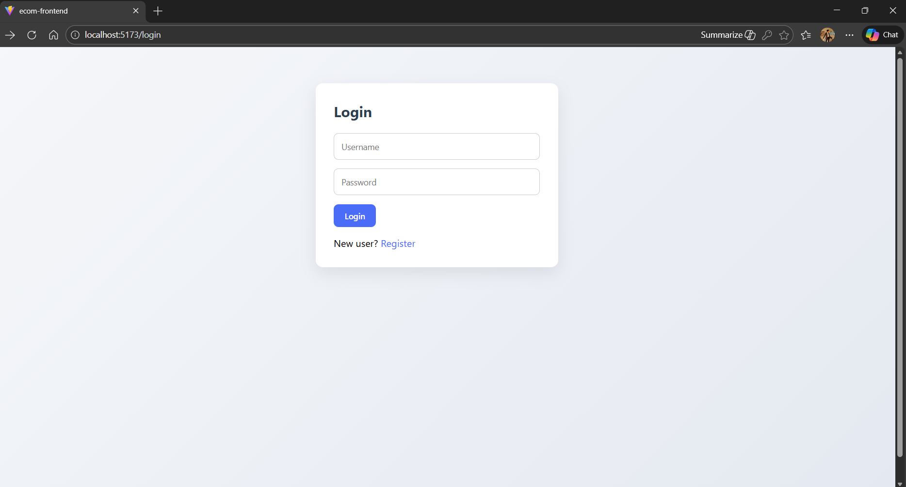
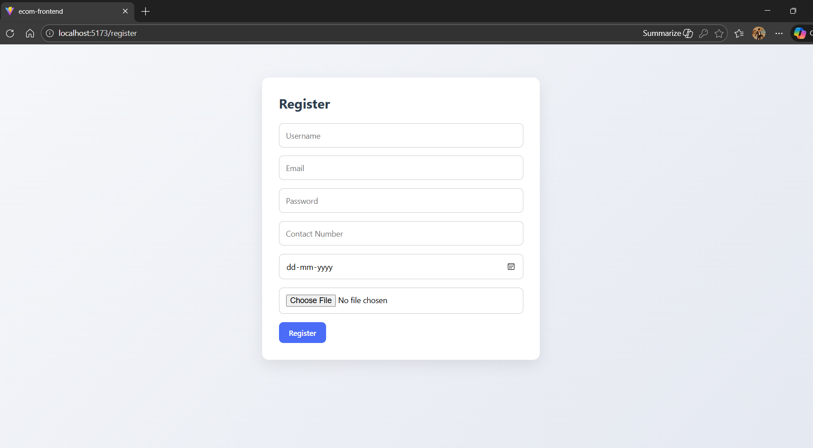
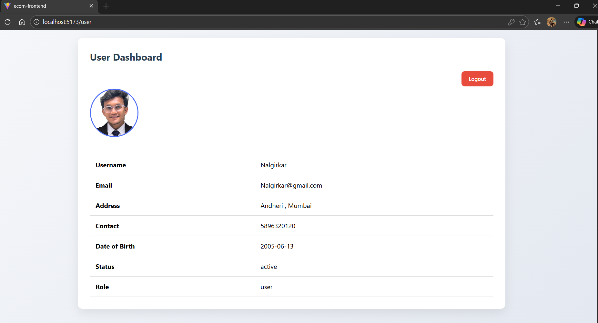

# 🛒 E-Commerce User Management System  
### Django REST Framework + React (Vite)


## 📌 Project Overview

This project is a **full-stack E-Commerce style User Management System** built using **Django REST Framework** for the backend and **React (Vite)** for the frontend.

It demonstrates **JWT-based authentication**, **role-based access control**, and **admin-level user management** with a clean and modern UI.


## 🧑‍💼 User Roles

### 🔹 Admin
- Login using admin credentials
- View all registered users in a table
- Activate / Deactivate users
- Logout securely

**Demo Admin Credentials (for evaluation):**
- Username: `omkar`
- Password: `omkar@5689`

> ⚠️ These credentials are provided only for demo and evaluation purposes.

### 🔹 User
- Register with address and profile photo
- Login & Logout
- View personal profile details
- Blocked from login if status is inactive


## 🚀 Features Implemented

✔ Admin / User Login  
✔ User Registration with Address & Profile Photo  
✔ JWT Authentication  
✔ Role-based Dashboards (Admin / User)  
✔ Admin User Management Table  
✔ Active / Inactive User Control  
✔ Inactive User Login Restriction  
✔ User Profile View (Table Format)  
✔ Secure Logout  
✔ Modern, Minimalist UI  


## 🛠️ Tech Stack

### 🔹 Backend
- Python
- Django
- Django REST Framework
- SimpleJWT
- SQLite
- django-cors-headers

### 🔹 Frontend
- React (Vite)
- Axios
- React Router DOM
- CSS (Modern minimalist design)


## ⚙️ How to Run the Project

### 🔹 Backend Setup (Django)

```bash
cd ecom_backend
pip install -r requirements.txt
python manage.py migrate
python manage.py createsuperuser
python manage.py runserver
```

Backend will run at :

- http://127.0.0.1:8000


## 🎨 Frontend – React (Vite)

### 📌 Frontend Overview

The frontend of this project is built using **React with Vite**. It provides a **modern, responsive, and minimalist UI** that communicates with the Django REST backend using **Axios**.

The frontend handles **authentication flow**, **role-based routing**, and **dashboard rendering** for both Admin and User roles.


## 🧩 Frontend Features

✔ Login & Registration Forms  
✔ JWT Token Handling (LocalStorage)  
✔ Role-based Routing (Admin / User)  
✔ Admin Dashboard – User Management Table  
✔ User Dashboard – Profile View with Photo  
✔ Logout Functionality  
✔ Protected Routes  
✔ Clean & Minimal UI Design  


## 🛠️ Frontend Tech Stack

- React (Vite)
- JavaScript (ES6+)
- Axios (API communication)
- React Router DOM (Routing)
- CSS (Modern, minimalist styling)


## ⚙️ How to Run the Frontend

```bash
cd ecom-frontend
npm install
npm run dev

```

Frontend will run at :

- http://localhost:5173


## 📸 Application Screenshots

**Login Page**  


**Register Page**  


**Admin Dashboard**  


**User Dashboard**  


---

## 🧠 Design & Architecture Highlights

- Clean separation of frontend & backend
- RESTful API design
- Role-based access control
- Secure JWT authentication
- Scalable and maintainable project structure
- Professional UI suitable for demos and interviews

---

## 📝 Author

**Omkar Nalgirkar**  
Python | Django | React Developer  

---

## ✅ Conclusion

This project demonstrates a real-world full-stack application with secure authentication, role-based authorization, admin-level user management, and a modern user interface using Django and React.

